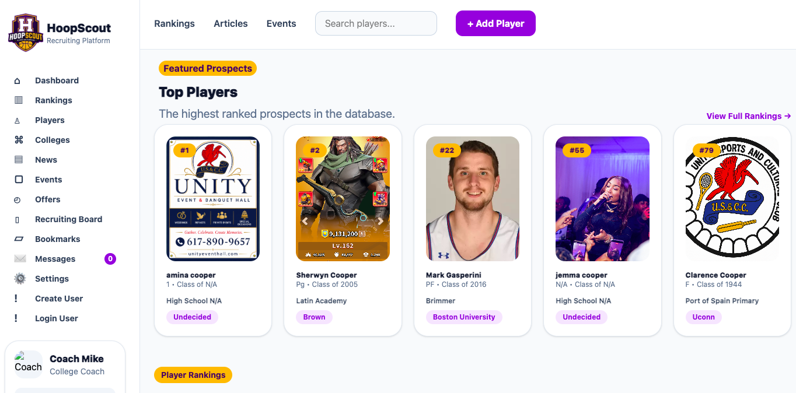

# HoopScout

A full-stack basketball recruiting platform built with React, Node.js, Express, MongoDB, Cloudinary, JWT Authentication, and Tailwind CSS.

## Screenshot

## Live Demo

https://hooprecruit.vercel.app/

## Demo Account

Recruiters and hiring managers can explore the administrative features using the demo account below:

Email: admin@hoopscout.com

Password: hoopscout14

## Features

Player Management
Create players
Update player profiles
Delete players
Upload player images to Cloudinary
View detailed player profiles
Search player database
User Management
Create users
Role-based access control
JWT authentication
Protected routes
Login and logout functionality
Image Upload System
Cloudinary image hosting
Custom React hook for image uploads
Upload progress handling
Upload validation
Disabled submit while uploads are in progress
Form Validation
Client-side validation using regular expressions
Email validation
Password strength validation
Phone number validation
Image file validation
Required field validation
Dynamic error messaging
Responsive Design
Mobile-first design
Tablet support
Desktop layouts
Tailwind CSS responsive breakpoints
Technologies Used
Frontend
React
React Router
Context API
Tailwind CSS
JavaScript (ES6+)
Backend
Node.js
Express
Database
MongoDB
Mongoose
Authentication
JSON Web Tokens (JWT)
Protected Routes
Role-Based Authorization
Storage
Cloudinary
Key Concepts Demonstrated
CRUD Operations
REST APIs
Authentication & Authorization
Custom React Hooks
Context API State Management
File Upload Handling
Responsive Design
Form Validation
Error Handling
Environment Variables
Deployment to Railway and Vercel
Future Enhancements
Server-side validation
Advanced player filtering
School database integration
Article management system
Analytics dashboard
Automated testing
Developer

## Sherwyn Cooper

Software Engineer with 8 years of experience building web applications and business solutions.
